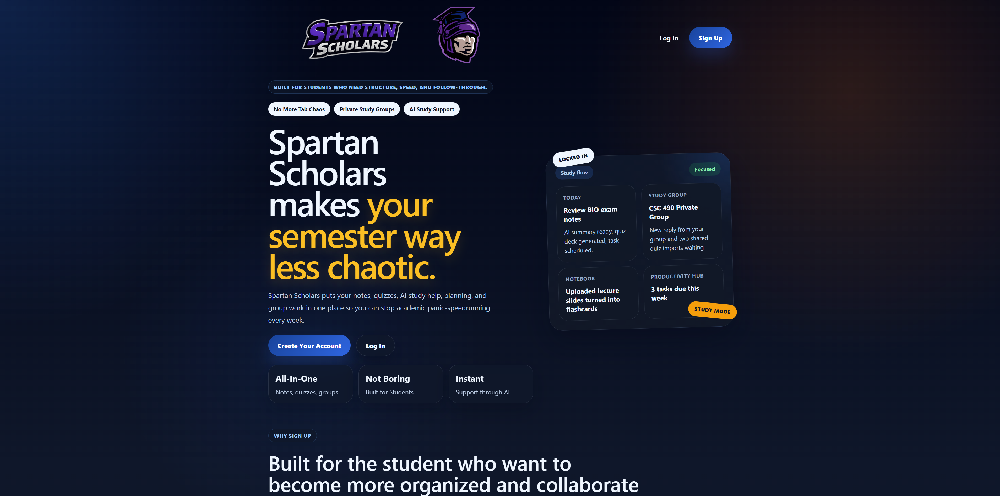
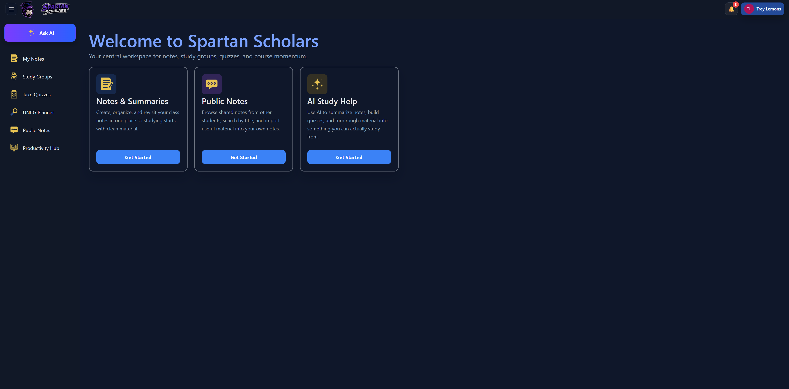
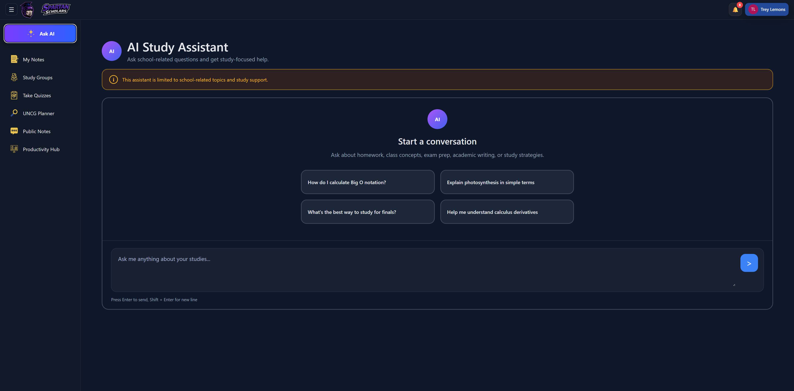
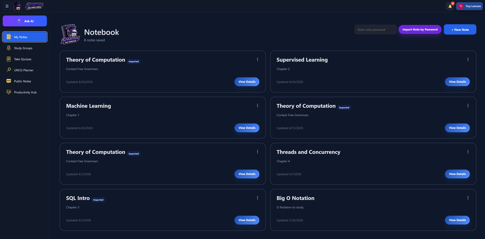
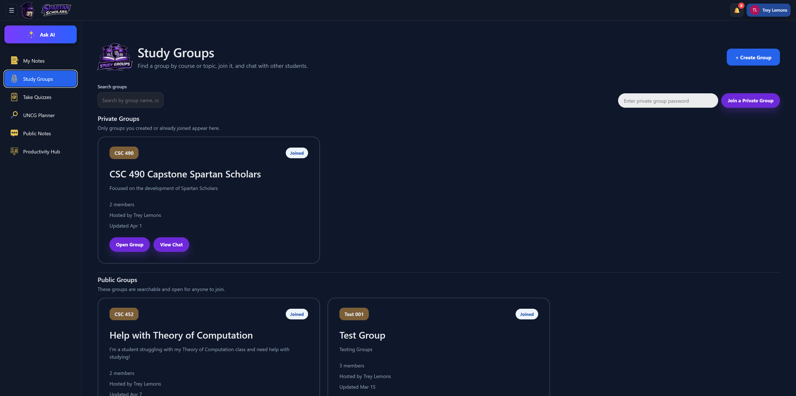

# Spartan Scholars

Spartan Scholars is a full-stack academic productivity platform built for college students who need one place to manage study materials, collaborate with classmates, prepare for quizzes, and organize degree planning tasks. The application combines note management, study groups, discussion boards, quiz tools, productivity tracking, and AI-powered academic assistance into a single student-focused web experience.

This project was developed as a capstone application with a React frontend, Spring Boot backend, PostgreSQL database, and OpenAI-powered study features.

## Features

- **User authentication and profiles**: Account registration, login, JWT-based authentication, profile updates, password changes, and profile image uploads.
- **AI study assistant**: OpenAI-powered chat support for academic questions and study planning.
- **Degree planning support**: UNCG planner tools, degree audit support, and program requirement exploration.
- **Notes and summaries**: Create, edit, upload, preview, download, share, and import notes.
- **Quiz tools**: Build test-style quizzes and flashcard decks manually or generate them with AI.
- **Study groups**: Create public or private study groups, join groups, post messages, and share notes or quizzes with group members.
- **Discussion board**: Create discussions, comment, like posts, and browse shared academic content.
- **Productivity hub**: Track tasks, calendar events, analytics, and AI-created productivity items.
- **Admin tools**: Admin access for viewing users and user-created content.
- **Responsive UI**: React-based frontend with reusable layout, routing, light/dark theme assets, and Bootstrap styling.

## Tech Stack

### Frontend

- React 19
- React Router
- Axios
- Bootstrap 5
- React Helmet Async
- React Easy Crop
- Create React App / React Scripts

### Backend

- Java 21
- Spring Boot 4
- Spring Web
- Spring Security
- Spring Data JPA
- Bean Validation
- JWT authentication
- Lombok
- Maven Wrapper

### Database and Integrations

- PostgreSQL
- Neon PostgreSQL compatible connection support
- OpenAI API
- Apache PDFBox
- Apache POI
- H2 for tests

## Installation and Setup

### Prerequisites

Make sure the following are installed:

- Java 21
- Node.js and npm
- PostgreSQL database access
- OpenAI API key

### 1. Clone the Repository

```powershell
git clone <(https://github.com/RGLEMONS7090/CSC490-Spartan-Scholars.git)>
cd CSC490-Spartan-Scholars
```

### 2. Configure Backend Environment Variables

The backend reads database, JWT, admin, and OpenAI settings from environment variables. Do not commit real credentials to the repository.

From a PowerShell terminal:

```powershell
cd C:\Users\diamo\Documents\GitHub\CSC490-Spartan-Scholars\backend

$env:DB_URL="jdbc:postgresql://<host>/<database>?sslmode=require"
$env:DB_USERNAME="<database-username>"
$env:DB_PASSWORD="<database-password>"

$env:JWT_SECRET="<long-random-jwt-secret>"
$env:ADMIN_PASSWORD="<admin-password>"
$env:OPENAI_API_KEY="<openai-api-key>"
$env:OPENAI_MODEL="gpt-5-mini"
```

If these variables are not provided, `backend/src/main/resources/application.properties` contains local development defaults for some values.

### 3. Run the Backend

In the backend terminal:

```powershell
.\mvnw.cmd spring-boot:run
```

The backend runs at:

```text
http://localhost:8080
```

### 4. Install Frontend Dependencies

Open a second terminal:

```powershell
cd C:\Users\diamo\Documents\GitHub\CSC490-Spartan-Scholars\frontend\react-frontend
npm install
```

### 5. Run the Frontend

In the frontend terminal:

```powershell
npm.cmd start
```

The React app runs at:

```text
http://localhost:3000
```

The frontend is configured to proxy API requests to the Spring Boot backend at `http://localhost:8080`.

## Folder Structure

```text
CSC490-Spartan-Scholars/
|-- backend/
|   |-- src/main/java/com/spartanscholars/backend/
|   |   |-- admin/             # Admin user and content management APIs
|   |   |-- ai/                # OpenAI-powered assistant and degree audit APIs
|   |   |-- auth/              # Login, registration, JWT, and security logic
|   |   |-- calendar/          # Calendar event APIs
|   |   |-- common/            # Shared exception handling
|   |   |-- discussion/        # Discussion board posts, comments, and likes
|   |   |-- note/              # Notes, uploads, previews, sharing, and imports
|   |   |-- notification/      # User notification APIs
|   |   |-- quiz/              # Quizzes, flashcards, attempts, sharing, and AI generation
|   |   |-- studygroup/        # Study group membership, messages, and shared items
|   |   |-- Todo/              # Productivity tasks
|   |   |-- user/              # Profiles and user account services
|   |   `-- web/               # Page route controller
|   |-- src/main/resources/
|   |   |-- application.properties
|   |   `-- static/            # Static legacy frontend assets
|   `-- pom.xml
|-- frontend/
|   |-- react-frontend/
|   |   |-- src/
|   |   |   |-- assets/        # Images, CSS, API helpers, and utility scripts
|   |   |   |-- components/    # Shared React components
|   |   |   |-- context/       # React context providers
|   |   |   |-- data/          # Degree plan data
|   |   |   |-- layout/        # Main application layout
|   |   |   `-- pages/         # Application pages and feature views
|   |   `-- package.json
|   |-- js/                    # Legacy JavaScript files
|   `-- *.html                 # Legacy static page versions
|-- Presentations/             # Project presentation documents
`-- README.md
```

## Team Members

- Trey Lemons
- Yajaira Alonso-Camarillo
- Aliyah W.

## Screenshots

### Landing Page



### Dashboard / Home



### AI Study Assistant



### Notes and Quizzes



### Study Groups



## Future Improvements

- Add automated end-to-end tests for major student workflows.
- Improve deployment documentation for production hosting.
- Add role-based permissions for group owners, moderators, and admins.
- Expand analytics with weekly trends, streaks, and study habit insights.
- Add real-time study group messaging with WebSockets.
- Support additional file import formats for notes and degree planning.
- Add richer notification settings and email reminders.
- Improve accessibility testing across all major pages.

## Project Status

Spartan Scholars is an active capstone project. The current version supports the core academic workflows needed for demonstration, including authentication, AI assistance, notes, quizzes, discussion boards, study groups, productivity tracking, and administrative review tools.
